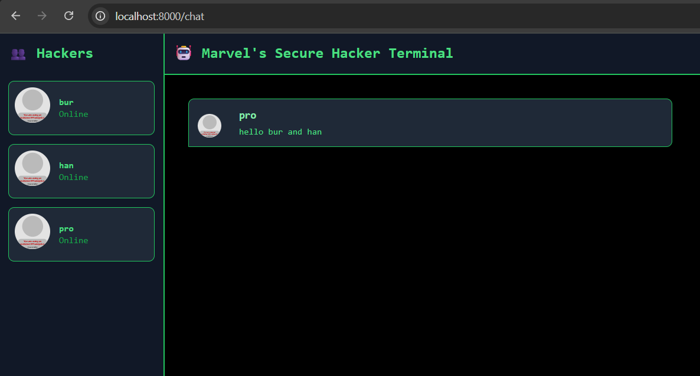

# YewChat 💬

> Source code for [Let’s Build a Websocket Chat Project With Rust and Yew 0.19 🦀](#)

## Install

1. Install the required toolchain dependencies:
   ```npm i```

2. Follow the YewChat post!

## Branches

This repository is divided to branches that correspond to the blog post sections:

* main - The starter code.
* routing - The code at the end of the Routing section.
* components-part1 - The code at the end of the Components-Phase 1 section.
* websockets - The code at the end of the Hello Websockets! section.
* components-part2 - The code at the end of the Components-Phase 2 section.
* websockets-part2 - The code at the end of the WebSockets-Phase 2 section.

# TUTORIAL 3

## Experiment 3.1


Explanation: > To run the original WebChat application, I had to set up two separate environments. First, I cloned and ran the NodeJS WebSocket server which listens for incoming connections on port 8080 and handles broadcasting messages. Second, I cloned the Rust-based Yew frontend. Because Yew compiles Rust into WebAssembly (WASM), the client-side code leverages wasm-bindgen to communicate with standard Web APIs (like WebSockets and DOM manipulation) directly from Rust. When the frontend is served and opened in the browser, the user first interacts with a Login component. Upon entering a nickname, the app transitions to the Chat component, establishes a WebSocket connection to the NodeJS server, and allows the user to send and receive real-time messages in a graphical web interface.

## Experiment 3.2



Explanation of modifications:
For this creativity exercise, I transformed the default bright UI into a "Dark Mode Hacker Terminal." Because the frontend uses Tailwind CSS, I didn't need to write a separate CSS file. Instead, I modified the utility classes directly inside the chat.rs component. I changed the background classes to bg-black and bg-gray-900, updated the text colors to text-green-400, and added green borders (border-green-500) to give it a retro computer feel. I also added the font-mono class to the main wrapper to make all the text look like a terminal. Finally, I updated the index.html file in the static folder to set the global body background to black so the edges of the screen match the theme seamlessly.

